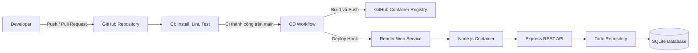

# DevOps Todo API

REST API quản lý công việc được xây dựng bằng Node.js, Express và SQLite. Dự án minh họa một quy trình DevOps hoàn chỉnh: kiểm tra mã nguồn, chạy test, đóng gói Docker, phát hành image lên GitHub Container Registry (GHCR) và triển khai tự động lên Render.

## Tính năng

- CRUD Todo qua REST API.
- Kiểm tra dữ liệu đầu vào và trả về HTTP status phù hợp.
- Lưu trữ dữ liệu bằng SQLite ở chế độ WAL.
- Ghi access log bằng Morgan.
- Integration test bằng Jest và Supertest.
- Kiểm tra coding style bằng ESLint.
- Docker multi-stage build và chạy container bằng non-root user.
- Health check cho Docker và Render.
- CI/CD tự động bằng GitHub Actions.

## Kiến trúc hệ thống



### Luồng xử lý ứng dụng

1. `src/server.js` đọc biến môi trường, mở SQLite database và khởi động HTTP server.
2. `src/app.js` cấu hình Express, middleware, validation và các API route.
3. `src/todoRepository.js` thực hiện các thao tác CRUD với SQLite.
4. `src/db.js` tạo thư mục dữ liệu, kết nối database và khởi tạo bảng `todos`.
5. Endpoint `/health` được Docker và Render dùng để kiểm tra trạng thái dịch vụ.

### Luồng CI/CD

1. Push hoặc pull request kích hoạt workflow `CI`.
2. CI cài dependencies bằng `npm ci`, chạy ESLint và test kèm coverage.
3. Khi CI trên nhánh `main` thành công, workflow `CD` được kích hoạt.
4. CD build Docker image và push hai tag lên GHCR:
   - `ghcr.io/lhuyhoang/devops-todo-api:latest`
   - `ghcr.io/lhuyhoang/devops-todo-api:<commit-sha>`
5. CD gọi Render Deploy Hook để Render triển khai phiên bản mới.
6. Render gọi `/health`; deployment chỉ sẵn sàng khi ứng dụng phản hồi thành công.

## Cấu trúc thư mục

```text
.
|-- .github/
|   `-- workflows/
|       |-- ci.yml              # Lint và test
|       `-- cd.yml              # Build image, push GHCR và gọi Render
|-- src/
|   |-- app.js                  # Express routes và validation
|   |-- db.js                   # Khởi tạo SQLite
|   |-- server.js               # Điểm khởi động ứng dụng
|   `-- todoRepository.js       # Truy cập dữ liệu Todo
|-- tests/
|   `-- app.test.js             # Integration tests
|-- .env.example                # Biến môi trường mẫu
|-- Dockerfile                  # Production container image
|-- docker-compose.yml          # Chạy local bằng Docker Compose
|-- render.yaml                 # Render Blueprint
|-- package.json
`-- README.md
```

## Yêu cầu

Chọn một trong hai cách chạy:

- Node.js 18 trở lên và npm; hoặc
- Docker Desktop có Docker Compose.

## Biến môi trường

| Biến | Mặc định | Mô tả |
| --- | --- | --- |
| `NODE_ENV` | `development` | Môi trường chạy ứng dụng |
| `PORT` | `3000` | Cổng HTTP của ứng dụng |
| `DATABASE_PATH` | `./data/todos.db` | Đường dẫn file SQLite |

Không commit file `.env`, token, password hoặc Render Deploy Hook vào repository.

## Chạy local bằng Node.js

### 1. Cài đặt

```bash
git clone https://github.com/lhuyhoang/DevOps-todo-API.git
cd DevOps-todo-API
npm ci
```

Sao chép file biến môi trường:

```bash
cp .env.example .env
```

PowerShell:

```powershell
Copy-Item .env.example .env
```

### 2. Kiểm tra mã nguồn

```bash
npm run lint
npm test
npm run test:coverage
```

### 3. Khởi động ứng dụng

```bash
npm start
```

Ứng dụng mặc định chạy tại `http://localhost:3000`.

Kiểm tra nhanh:

```bash
curl http://localhost:3000/health
curl http://localhost:3000/api/todos
```

## Chạy bằng Docker Compose

Build và chạy container:

```bash
docker compose up --build
```

Chạy nền:

```bash
docker compose up --build -d
```

Xem trạng thái và log:

```bash
docker compose ps
docker compose logs -f app
```

Dừng ứng dụng:

```bash
docker compose down
```

Dữ liệu SQLite được giữ trong named volume `todo-data`. Chỉ xóa volume khi không cần giữ dữ liệu:

```bash
docker compose down -v
```

## API endpoints

| Method | Endpoint | Mô tả | Success status |
| --- | --- | --- | --- |
| `GET` | `/health` | Kiểm tra trạng thái dịch vụ | `200` |
| `GET` | `/api/todos` | Lấy danh sách Todo | `200` |
| `GET` | `/api/todos/:id` | Lấy một Todo | `200` |
| `POST` | `/api/todos` | Tạo Todo | `201` |
| `PUT` | `/api/todos/:id` | Cập nhật Todo | `200` |
| `DELETE` | `/api/todos/:id` | Xóa Todo | `204` |

### Tạo Todo

```bash
curl -X POST http://localhost:3000/api/todos \
  -H "Content-Type: application/json" \
  -d '{"title":"Học Docker"}'
```

### Cập nhật Todo

```bash
curl -X PUT http://localhost:3000/api/todos/1 \
  -H "Content-Type: application/json" \
  -d '{"title":"Hoàn thành pipeline","completed":true}'
```

### Xóa Todo

```bash
curl -X DELETE http://localhost:3000/api/todos/1
```

Khi kiểm thử bằng Postman, đặt biến environment:

```text
base_url = http://localhost:3000
```

Sau khi deploy, đổi thành:

```text
base_url = https://devops-todo-api.onrender.com
```

## Deploy lên Render

Repository đã có `Dockerfile` và `render.yaml`. Có thể tạo service bằng Render Blueprint hoặc cấu hình Web Service thủ công.

### 1. Push repository lên GitHub

```bash
git add <cac-file-can-commit>
git commit -m "feat: update application"
git push origin main
```

Nên chỉ stage những file cần commit; kiểm tra bằng `git status` trước khi push.

### 2. Tạo Render Web Service

Trong Render Dashboard:

1. Chọn **New → Blueprint** và kết nối repository này; hoặc chọn **New → Web Service**.
2. Chọn runtime **Docker**.
3. Chọn branch `main` và Dockerfile ở thư mục gốc.
4. Đặt health check path là `/health`.
5. Cấu hình các biến môi trường:

```text
NODE_ENV=production
DATABASE_PATH=/app/data/todos.db
```

Render tự cung cấp biến `PORT`; ứng dụng đọc biến này khi khởi động.

### 3. Cấu hình Deploy Hook

1. Mở Render service và tạo **Deploy Hook** cho branch `main`.
2. Trên GitHub, mở **Settings → Secrets and variables → Actions**.
3. Tạo repository secret:

```text
RENDER_DEPLOY_HOOK
```

4. Dán URL Deploy Hook vào giá trị secret. Không ghi URL này vào source code, log, ảnh chụp hoặc README.

### 4. Kiểm tra GitHub Actions

Sau khi push lên `main`:

1. Mở tab **Actions** trên GitHub.
2. Chờ workflow `CI` hoàn thành với trạng thái xanh.
3. Chờ workflow `CD` hoàn thành các bước đăng nhập GHCR, build/push image và gọi Render Deploy Hook.
4. Mở Render Dashboard và chờ trạng thái `Deploy succeeded` hoặc `Live`.

### 5. Xác nhận ứng dụng production

```bash
curl https://devops-todo-api.onrender.com/health
```

Kết quả mong đợi:

```json
{
  "status": "ok",
  "service": "todo-api"
}
```

Có thể kiểm tra toàn bộ CRUD bằng Postman với `base_url` là URL production.

> [!IMPORTANT]
> File SQLite trong filesystem của Render có thể không tồn tại qua lần deploy hoặc restart nếu service không gắn persistent disk. Với production thực tế, hãy cấu hình persistent disk cho `/app/data` hoặc chuyển sang PostgreSQL. Docker Compose local đã dùng named volume nên dữ liệu được giữ khi container được tạo lại.

## Xử lý lỗi thường gặp

### CI không chạy CD

- CD chỉ chạy sau khi workflow `CI` thành công trên nhánh `main`.
- Kiểm tra lỗi lint và test trong GitHub Actions.
- Kiểm tra workflow vẫn có tên `CI`, vì CD tham chiếu tên này.

### Bước Trigger Render deploy bị bỏ qua hoặc thất bại

- Kiểm tra secret `RENDER_DEPLOY_HOOK` đã tồn tại.
- Tạo lại Deploy Hook nếu URL cũ đã bị thu hồi.
- Không in giá trị secret ra log để kiểm tra.

### Render không chuyển sang trạng thái Live

- Kiểm tra Render build log và application log.
- Kiểm tra `/health` trả về HTTP `200`.
- Kiểm tra các biến `PORT` và `DATABASE_PATH`.

### Request đầu tiên phản hồi chậm

Service ở gói miễn phí có thể cần thời gian khởi động lại sau một khoảng không hoạt động. Chờ service chuyển sang `Live` rồi gửi lại request.

## Liên kết

- Repository: <https://github.com/lhuyhoang/DevOps-todo-API>
- GitHub Actions: <https://github.com/lhuyhoang/DevOps-todo-API/actions>
- Production health check: <https://devops-todo-api.onrender.com/health>
