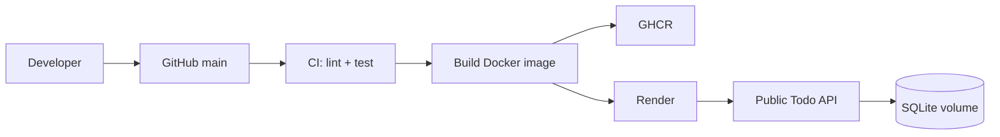

# Báo cáo cá nhân: DevOps cho ứng dụng Web Node.js

> Thay các phần trong dấu `[...]` trước khi nộp.

## 1. Trang bìa

- Họ và tên: [...]
- Mã số học viên: [...]
- Lớp: [...]
- Tên bài tập: DevOps cho ứng dụng Web Node.js

## 2. Mục tiêu và phạm vi

Mô tả mục tiêu xây dựng Todo REST API và tự động hóa kiểm thử, đóng gói, phát hành, triển khai.

## 3. Kiến trúc hệ thống

Ứng dụng Express chạy trong Docker, lưu dữ liệu SQLite tại volume; GitHub Actions thực hiện CI rồi CD tới registry và Render.

## 4. Quá trình thực hiện

### Dockerize

[Mô tả Dockerfile multi-stage, non-root user, health check và docker compose. Chèn ảnh.]

### CI/CD

[Mô tả các bước workflow và chèn ảnh pipeline chạy thành công.]

### Quản lý secrets

[Liệt kê `RENDER_DEPLOY_HOOK` và cách cấu hình GitHub Secrets, không chụp giá trị secret.]

## 5. Khó khăn và cách giải quyết

- [...]

## 6. Lessons learned

- [...]

## 7. Hướng phát triển

- Dùng PostgreSQL managed cho production.
- Thêm Prometheus/Grafana và cảnh báo.
- Thêm staging environment và rollback strategy.

## 8. Liên kết nộp bài

- GitHub: [...]
- App đã deploy: [...]
- Video demo: [...]
